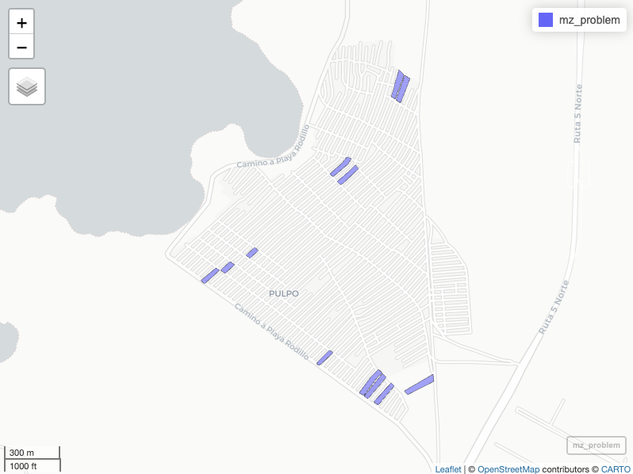
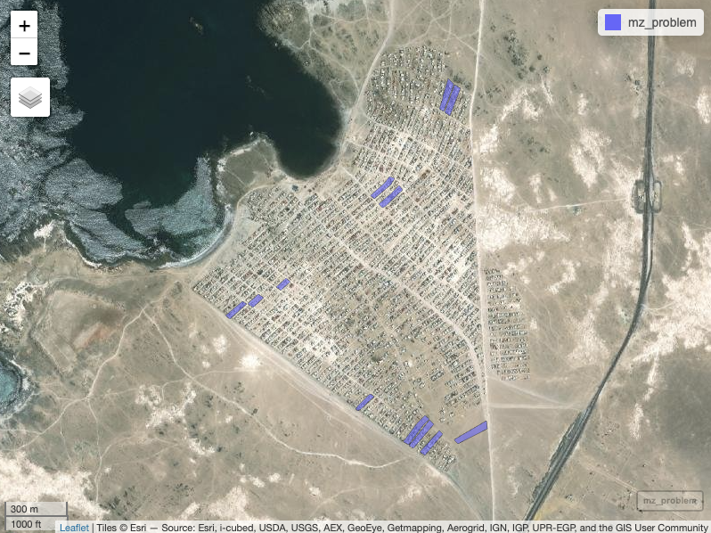
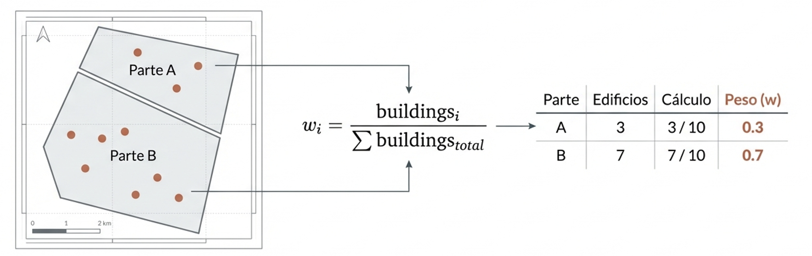

```{r setup, include=FALSE}
knitr::opts_chunk$set(echo = TRUE)
suppressPackageStartupMessages(library(dplyr))
suppressPackageStartupMessages(library(sf))
suppressPackageStartupMessages(library(tidyr))
suppressPackageStartupMessages(library(ggplot2))
suppressPackageStartupMessages(library(knitr))
```

## Propósito del capítulo

Hasta aquí hemos aprendido a organizar, transformar, representar y analizar datos espaciales. En este capítulo reuniremos esas capacidades para responder una pregunta aplicada: **¿cómo convertir un problema territorial en una medida que pueda compararse entre lugares?**

Al finalizar, podrás:

- distinguir un indicador general de uno territorial;
- reconocer las decisiones conceptuales y técnicas involucradas en su construcción;
- comprender por qué fue necesario corregir algunas geometrías censales y cómo se utiliza el ponderador `w`;
- calcular, normalizar y cartografiar indicadores socioeconómicos con datos agregados del Censo 2024; y
- diferenciar una medición directa de un proxy y comunicar sus límites de interpretación.

## Conceptos fundamentales

### De los datos al indicador

Un **indicador** es una medida que sintetiza un fenómeno relevante para describir su estado, seguir su evolución o evaluar un resultado. No es un dato aislado: adquiere sentido cuando se vincula con una pregunta, una población de referencia, un periodo y una regla de cálculo.

Un **indicador territorial** incorpora, además, una unidad geográfica explícita —por ejemplo, una región, una comuna o una manzana—. Esto permite comparar lugares, reconocer desigualdades espaciales y orientar decisiones públicas. Una tasa de desocupación comunal, la distancia al centro de salud más cercano o la proporción de viviendas con materialidad insuficiente son ejemplos de indicadores territoriales.

{fig-align="center" width="400" fig-alt="Un indicador territorial vincula una medida con un área geográfica delimitada."}

Un indicador bien definido debe explicitar, al menos:

- **qué mide** y por qué es relevante;
- **a quiénes o qué unidades representa**;
- **dónde y cuándo** es válido;
- **cómo se calcula**, incluidos numerador, denominador y tratamiento de valores faltantes; y
- **cómo se interpreta**, especialmente qué significan sus valores bajos y altos.

::: {.callout-important title="La escala también forma parte del indicador"}
Un patrón observado por región puede cambiar al calcularse por comuna o manzana. Por eso, toda comparación debe usar unidades geográficas y periodos equivalentes. Los resultados describen áreas, no necesariamente a cada persona que vive en ellas; confundir ambos niveles conduce a una **falacia ecológica**.
:::

### Tipos y usos

Los indicadores pueden organizarse según la dimensión territorial que representan. En este curso trabajaremos principalmente con cuatro familias:

| Dimensión | Pregunta orientadora | Ejemplos |
|---|---|---|
| Accesibilidad | ¿Con qué facilidad se llega a servicios y oportunidades? | tiempo de viaje, distancia, cobertura |
| Socioeconómica | ¿Qué condiciones sociales y materiales caracterizan el área? | escolaridad, empleo, vivienda |
| Seguridad | ¿Cómo se distribuyen los riesgos y hechos delictuales? | tasas, concentración, exposición |
| Ambiental | ¿Qué presiones o beneficios ambientales recibe la población? | contaminación, áreas verdes, amenazas |

En la práctica, estas medidas apoyan cuatro tareas: **diagnosticar** brechas actuales, **monitorear** cambios, **comparar** escenarios y **evaluar** políticas o proyectos. El mapa ayuda a comunicar el resultado, pero no reemplaza la definición conceptual ni el análisis.

## Ruta para construir un indicador territorial

{fig-align="center" fig-alt="Siete etapas para construir un indicador territorial: problema, marco de referencia, objetivos, datos, cálculo, representación y análisis."}

La construcción no comienza con una fórmula. Sigue una cadena de decisiones conectadas:

1. **Delimitar el problema.** Precisar el fenómeno, la población afectada, el territorio y el periodo de interés.
2. **Establecer un marco de referencia.** Revisar conceptos, evidencia y criterios que justifiquen qué aspecto del problema se medirá.
3. **Formular el objetivo.** Expresar para qué se utilizará el indicador. Un objetivo claro debe ser específico, medible, alcanzable, relevante y acotado en el tiempo.
4. **Seleccionar los datos.** Verificar pertinencia, cobertura, escala, actualidad, consistencia y posibilidad de acceso. La disponibilidad de una variable no basta para justificar su uso.
5. **Definir y calcular la medida.** Documentar variables, fórmula, unidad, denominadores, valores faltantes, normalización y dirección del indicador.
6. **Representar el patrón espacial.** Elegir una clasificación y una simbología coherentes con la distribución de los datos y con el mensaje que se desea comunicar.
7. **Analizar y validar.** Contrastar el resultado con el problema inicial, revisar valores extremos y sensibilidad a las decisiones metodológicas, e identificar límites de interpretación.

::: {.callout-tip title="Una ficha mínima antes de programar"}
Antes de escribir código, completa una frase como esta: *Este indicador mide ___, para ___, en ___, durante ___; se calcula mediante ___ y un valor alto significa ___.* Si quedan espacios ambiguos, la medida todavía no está suficientemente definida.
:::

### Fuentes nacionales frecuentes

La fuente adecuada depende de la pregunta y de la escala. Entre los recursos más utilizados en Chile se encuentran:

| Fuente | Aporte principal |
|---|---|
| [Censos de población y vivienda](https://www.ine.gob.cl/estadisticas-por-tema/demografia-y-poblacion/censo-de-poblacion-y-vivienda) | población, hogares y viviendas con alta desagregación territorial |
| [Encuesta CASEN](https://observatorio.ministeriodesarrollosocial.gob.cl/encuesta-casen) | ingresos y condiciones socioeconómicas de los hogares |
| [Encuesta Nacional de Empleo](https://www.ine.gob.cl/estadisticas-por-tema/mercado-laboral/ocupacion-y-desocupacion) | empleo, desempleo y fuerza de trabajo |
| [Encuesta Nacional Urbana de Seguridad Ciudadana](https://www.ine.gob.cl/estadisticas-por-tema/sociedad-y-condiciones-de-vida/seguridad-ciudadana) | victimización y percepción de inseguridad |
| [Sistema Nacional de Información Municipal](https://datos.sinim.gov.cl/) | gestión, finanzas y servicios municipales |
| [Portal de Datos Abiertos](https://datos.gob.cl/) | conjuntos de datos publicados por organismos del Estado |
| [IDE Chile](https://geoportal.cl/geoportal/catalog) | catálogo de información geoespacial pública |

Al utilizar encuestas, recuerda que la representatividad estadística limita el nivel territorial al que se pueden producir estimaciones confiables.

## Caso aplicado: dimensión socioeconómica 2024 {#sec-indsoc}

La **Matriz de Bienestar Humano Territorial (MBHT)**, desarrollada por el Centro de Inteligencia Territorial de la Universidad Adolfo Ibáñez, organiza indicadores en cuatro dimensiones: accesibilidad, ambiente, seguridad y condiciones socioeconómicas. En este ejercicio construiremos una versión pedagógica de la dimensión socioeconómica con variables agregadas del **Censo de Población y Vivienda 2024**.

::: {#fig-mbht}
{fig-align="center" fig-alt="Dimensiones de la Matriz de Bienestar Humano Territorial."}

Dimensiones de la Matriz de Bienestar Humano Territorial
:::

Calcularemos cinco indicadores: empleo, materialidad de la vivienda, suficiencia de la vivienda, escolaridad adulta y estructura de los hogares. Todos se orientarán en la misma dirección: **un valor más alto representará una situación relativamente más favorable**.

| Indicador | Estado con los tabulados 2024 | Qué representa |
|---|---|---|
| `IEM` | medición directa | participación de la población activa en el empleo |
| `IVI` | medición directa | calidad material de la vivienda |
| `ISV` | proxy | suficiencia de la vivienda a partir de señales de hacinamiento |
| `IEA` | proxy | escolaridad promedio de la población de 18 años o más |
| `IRH` | proxy | señal compuesta de estructura de hogares |
| `IPJ` | no calculable | requiere un cruce conjunto de edad, estudio y trabajo no disponible |

::: {.callout-note title="Qué significa proxy"}
Un **proxy** es una medida indirecta: utiliza variables observables relacionadas con un concepto que no puede medirse directamente con los datos disponibles. No debe presentarse como equivalente al fenómeno original. Su nombre, fórmula, universo, supuestos y límites deben acompañar siempre el resultado.
:::

### Datos y unidad de análisis

El insumo nacional contiene geometrías censales corregidas y variables agregadas de personas, hogares y viviendas. En este capítulo trabajaremos con la localidad censal **LA SERENA - COQUIMBO**, perteneciente a la Región de Coquimbo (`COD_REGION == "04"`) y distribuida entre las comunas de Coquimbo y La Serena. En la base, esta unidad se identifica exactamente mediante `LOCALIDAD == "LA SERENA - COQUIMBO"`.

**Lectura de Censo Nacional 2024**

Durante la publicación del libro, el siguiente bloque carga el archivo desde su ubicación en el proyecto. Se ejecuta, pero se oculta porque el estudiantado utilizará una ruta diferente.

```{r load-national-data, eval=TRUE, echo=FALSE}
# Guardamos la ubicación del archivo para no repetirla al leer los datos.
path_censo_2024 <- "../sesiones/data/censo-2024/censo_2024_nacional.gpkg"

# st_read() lee el GeoPackage y conserva tanto los atributos como las geometrías.
data_nac <- st_read(path_censo_2024, quiet = TRUE)
```

Para reproducir el ejercicio, utiliza la ruta correspondiente a tu carpeta de trabajo. Este bloque se muestra como referencia y no se ejecuta al publicar el capítulo.

```{r student-data-path, echo=TRUE, eval=FALSE}
# Cambia esta ruta si guardaste el archivo en otra carpeta.
path_censo_2024 <- "data/censo-2024/censo_2024_nacional.gpkg"

# Leemos la capa espacial completa del Censo 2024.
data_nac <- st_read(path_censo_2024, quiet = TRUE)
```

**Filtrar por Área de Estudio**

```{r load-data, echo=TRUE}
# Definimos por separado los tres criterios que delimitan el área de estudio.
reg <- "04"
comunas_estudio <- c("COQUIMBO", "LA SERENA")
localidad <- "LA SERENA - COQUIMBO"

# filter() conserva únicamente las filas que cumplen todos los criterios.
data_reg <- data_nac %>%
  filter(
    COD_REGION == reg,
    COMUNA %in% comunas_estudio,
    LOCALIDAD == localidad
  )

# nrow() cuenta cuántas geometrías quedaron después del filtro.
cat("Geometrías de la localidad", localidad, ":", nrow(data_reg), "\n")
```

```{r region-table, echo=FALSE}
#| tbl-cap: Geometrías censales de la localidad LA SERENA - COQUIMBO por comuna

data_reg %>%
  st_drop_geometry() %>%
  count(COMUNA, name = "n_geometrias", sort = TRUE) %>%
  kable()
```

## Corrección geométrica y ponderador `w`

### ¿Por qué fue necesaria la corrección?

En el insumo censal se identificaron casos en los que un mismo ID estaba asociado a más de un polígono. Algunas geometrías multipartes representan una unidad espacial coherente; otras contienen partes físicamente separadas que necesitan tratarse como polígonos independientes para evitar errores de visualización, agregación e interpretación.

::: {#fig-w layout-ncol=2}

 



Manzanas que comparten el mismo número de identificación.
:::


Cuando una unidad se separa, sus atributos no pueden copiarse íntegramente a cada nueva parte, porque eso duplicaría personas, hogares y viviendas. La corrección geométrica asigna un identificador derivado a cada parte y calcula un peso de redistribución `w`.

### ¿Cómo se obtiene `w`?

La huella construida se utiliza como evidencia de ocupación. Para cada parte geométrica se calcula el número o el área de las edificaciones contenidas. El peso de la parte $i$ se expresa como:

{fig-align="center" fig-alt="Distribución de edificaciones para crear valore de $w$ pesos de edificaciones por manzana."}

<br>

$$
w_i =
\frac{\text{medida de edificaciones en la parte } i}
{\sum_j \text{medida de edificaciones de las partes del mismo ID}}
$$

La medida principal puede ser el área construida o el conteo de edificaciones, según la configuración del proceso. Si no existe evidencia construida suficiente, se utiliza un método de respaldo basado en el área del terreno o en una distribución uniforme.

Para los IDs efectivamente redistribuidos se debe cumplir:

$$
\sum_i w_i = 1
$$

De esta forma, una variable absoluta $x$ se asigna a cada parte mediante:

$$
x_i = x \times w_i
$$

### ¿A qué variables se aplica?

El peso se aplica a **conteos absolutos**, como número de personas, hogares o viviendas. No se aplica a promedios ya calculados, como `prom_escolaridad18`. Además:

- `w = 1` indica que el registro conserva el valor completo;
- `0 < w < 1` indica que el atributo se redistribuye proporcionalmente; y
- `w = 0` es válido para una parte que no recibe atributos después de la redistribución.

Cuando un indicador es una razón y el mismo `w` se aplica al numerador y al denominador, el peso se cancela algebraicamente:

$$
\frac{a \times w}{b \times w} = \frac{a}{b}, \qquad w > 0
$$

Esto significa que `w` preserva la consistencia de los **conteos**, pero no crea por sí solo variación interna en las proporciones de las partes derivadas de una misma unidad.

::: {.callout-important title="Dos pesos diferentes"}
En este capítulo aparecen dos símbolos que no deben confundirse: `w` es el **peso geométrico de redistribución** incluido en la base; `w_hac = 2` es una **ponderación conceptual de criticidad** usada únicamente en el proxy de suficiencia de la vivienda.
:::

### Validación y aplicación

Definimos tres funciones breves para evitar divisiones por cero, acotar proporciones y normalizar los indicadores.

#### Función para calcular proporciones de forma segura

`proporcion_segura()` divide dos columnas elemento por elemento. Cuando el denominador es cero o está ausente, devuelve `NA` en lugar de producir un resultado inválido.

```{r helper-safe-proportion}
# Calcula una proporción y evita dividir por cero o por un valor ausente.
proporcion_segura <- function(numerador, denominador) {
  # if_else() evalúa la condición para cada par de valores.
  if_else(
    !is.na(denominador) & denominador > 0,
    numerador / denominador,
    # NA_real_ representa un valor numérico decimal ausente.
    NA_real_
  )
}
```

#### Función para mantener valores entre 0 y 1

`acotar_01()` corrige valores menores que 0 o mayores que 1. Esto resulta útil cuando una proporción presenta pequeñas inconsistencias y debe permanecer en su intervalo teórico.

```{r helper-clamp}
# Limita cada valor al intervalo cerrado entre 0 y 1.
acotar_01 <- function(x) {
  # pmax() reemplaza los valores menores que 0 por 0.
  x_sin_negativos <- pmax(x, 0)

  # pmin() reemplaza los valores mayores que 1 por 1.
  pmin(x_sin_negativos, 1)
}
```

#### Función para normalizar mediante mínimos y máximos

`minmax()` transforma una variable para que su mínimo sea 0 y su máximo sea 1. Si no existe un rango válido —por ejemplo, porque todos los valores son iguales—, devuelve `NA` y evita una división por cero.

```{r helper-minmax}
# Reescala un vector numérico al intervalo entre 0 y 1.
minmax <- function(x) {
  # range() obtiene el mínimo y el máximo e ignora los valores ausentes.
  rango <- range(x, na.rm = TRUE)

  # La normalización no es posible sin extremos finitos o sin variación.
  if (!all(is.finite(rango)) || diff(rango) == 0) {
    return(rep(NA_real_, length(x)))
  }

  # Restamos el mínimo y dividimos por la amplitud total del rango.
  (x - rango[1]) / diff(rango)
}
```

#### Paso 1: identificar los conteos que deben redistribuirse

Primero reunimos en un vector los nombres de las variables absolutas. Esta lista permitirá aplicar la misma operación a todas ellas sin repetir el código.

```{r weighting-variables}
# Cada texto corresponde al nombre de una columna con un conteo absoluto.
vars_conteo <- c(
  "n_per", "n_vp", "n_desocupado", "n_ocupado",
  "n_mat_paredes_tabique_sin_forro",
  "n_mat_paredes_artesanal",
  "n_mat_paredes_precarios",
  "n_mat_techo_fonolita",
  "n_mat_techo_precarios",
  "n_mat_techo_sin_cubierta",
  "n_mat_piso_capa_cemento",
  "n_mat_piso_tierra",
  "n_viv_hacinadas",
  "n_vp_ocupada",
  "n_nucleos_hacinados_allegados",
  "n_hog",
  "n_jefatura_mujer",
  "n_hog_menores"
)
```

#### Paso 2: comprobar el rango de los pesos

Antes de usarlos, verificamos que todos los valores de `w` estén presentes y pertenezcan al intervalo $[0,1]$. La función `stop()` detiene la ejecución si detecta un problema.

```{r validate-weight-range}
# any() será TRUE si al menos un peso incumple alguna condición.
if (any(is.na(data_reg$w) | data_reg$w < 0 | data_reg$w > 1)) {
  stop("El ponderador w contiene valores faltantes o fuera de [0, 1].")
}
```

#### Paso 3: comprobar la suma de los pesos

Luego agrupamos las partes que provienen de un mismo ID. En los casos redistribuidos, sus pesos deben sumar 1 para conservar el total original.

```{r validate-weight-sum}
# Resumimos las partes de cada unidad censal original.
control_w <- data_reg %>%
  st_drop_geometry() %>%
  group_by(.id) %>%
  summarise(
    n_partes = n(),
    usa_redistribucion = any(w < 1),
    suma_w = sum(w),
    .groups = "drop"
  ) %>%
  filter(usa_redistribucion)

# La tolerancia 1e-6 evita rechazar pequeñas diferencias de redondeo.
if (any(abs(control_w$suma_w - 1) > 1e-6)) {
  stop("Los pesos de uno o más IDs redistribuidos no suman 1.")
}
```

#### Paso 4: aplicar los pesos a los conteos

Finalmente construimos `censo`. `transmute()` crea una tabla nueva con las columnas que necesitamos, mientras `across()` multiplica cada conteo de la lista por su peso `w`. El promedio de escolaridad se conserva sin ponderar porque no es un conteo absoluto.

```{r apply-weights}
# Creamos la base de trabajo y redistribuimos únicamente los conteos absolutos.
censo <- data_reg %>%
  transmute(
    id_original = .id,
    ID_MANZ,
    ID_MANZCIT,
    MANZENT,
    TIPO_MZ,
    COD_REGION,
    COMUNA,
    AREA_C,
    LOCALIDAD,
    n_buildings,
    area_sum,
    w,
    # Esta variable ya es un promedio y no debe multiplicarse por w.
    prom_escolaridad18,
    # .x representa, por turno, cada columna incluida en vars_conteo.
    across(all_of(vars_conteo), ~ .x * w)
  )
```

```{r weight-summary, echo=FALSE}
#| tbl-cap: Control del ponderador geométrico en la localidad estudiada

tibble(
  control = c(
    "Geometrías censales de la localidad",
    "IDs con redistribución",
    "Partes con w = 0",
    "IDs redistribuidos cuya suma de w es 1"
  ),
  valor = c(
    nrow(data_reg),
    nrow(control_w),
    sum(data_reg$w == 0),
    sum(abs(control_w$suma_w - 1) <= 1e-6)
  )
) %>%
  kable()
```

## Cálculo de indicadores 2024

### IEM — Indicador de empleo

El IEM mide la condición de empleo como el complemento de la proporción de personas desocupadas dentro de la población activa.

**Variables**

- `n_desocupado`: personas desocupadas.
- `n_ocupado`: personas ocupadas.

$$
CESA = \frac{n_{desocupado}}{n_{desocupado} + n_{ocupado}}
$$

$$
IEM = 1 - CESA
$$

Si la población activa es cero, el indicador no está definido y se registra como `NA`.

```{r calc-iem}
# Añadimos a la base la tasa de desocupación y su indicador complementario.
censo <- censo %>%
  mutate(
    # Calculamos la proporción de personas desocupadas en la población activa.
    CESA_DENS = proporcion_segura(
      n_desocupado,
      n_desocupado + n_ocupado
    ),
    # Invertimos la proporción: un IEM alto representa una mejor condición.
    IEM = 1 - acotar_01(CESA_DENS)
  )
```

Todos los mapas del capítulo siguen la misma estructura: `ggplot()` inicia el gráfico, `geom_sf()` dibuja las geometrías, `scale_fill_viridis_c()` define la escala de colores y `labs()` agrega los textos. Los valores ausentes se muestran en gris claro.

```{r map-iem, echo=TRUE, fig.height=6, fig.width=8}
#| fig-cap: Indicador de empleo en la localidad LA SERENA - COQUIMBO

# Iniciamos el mapa usando la base espacial censo.
ggplot(censo) +
  # Dibujamos cada geometría y la coloreamos según su valor de IEM.
  geom_sf(aes(fill = IEM), color = NA) +
  # Usamos una escala continua entre 0 y 1.
  scale_fill_viridis_c(
    option = "C",
    limits = c(0, 1),
    na.value = "grey90",
    name = "IEM"
  ) +
  labs(
    title = "Indicador de empleo",
    subtitle = "Localidad LA SERENA - COQUIMBO"
  ) +
  theme_bw()

```

### IVI — Indicador de materialidad de la vivienda

El IVI sintetiza carencias de materialidad en paredes, techo y piso. Cada componente se calcula sobre el total de viviendas particulares y luego se invierte para que un valor alto represente una mejor condición material.

**Variables**

- Paredes: `n_mat_paredes_tabique_sin_forro`, `n_mat_paredes_artesanal` y `n_mat_paredes_precarios`.
- Techo: `n_mat_techo_fonolita`, `n_mat_techo_precarios` y `n_mat_techo_sin_cubierta`.
- Piso: `n_mat_piso_capa_cemento` y `n_mat_piso_tierra`.
- Denominador: `n_vp`, total de viviendas particulares.

$$
\begin{aligned}
paredes &= \frac{tabique\_sin\_forro + artesanal + precarios}{n_{vp}} \\
techo &= \frac{fonolita + techo\_precario + sin\_cubierta}{n_{vp}} \\
suelo &= \frac{capa\_cemento + tierra}{n_{vp}} \\
IVI &= 1 - \frac{paredes + techo + suelo}{3}
\end{aligned}
$$

Cada componente se acota al intervalo $[0,1]$ para controlar inconsistencias puntuales derivadas de la agregación.

```{r calc-ivi}
# Calculamos por separado las tres proporciones de materialidad insuficiente.
censo <- censo %>%
  mutate(
    paredes = proporcion_segura(
      n_mat_paredes_tabique_sin_forro +
        n_mat_paredes_artesanal +
        n_mat_paredes_precarios,
      n_vp
    ),
    techo = proporcion_segura(
      n_mat_techo_fonolita +
        n_mat_techo_precarios +
        n_mat_techo_sin_cubierta,
      n_vp
    ),
    suelo = proporcion_segura(
      n_mat_piso_capa_cemento + n_mat_piso_tierra,
      n_vp
    ),
    # Ajustamos las tres proporciones para mantenerlas entre 0 y 1.
    across(c(paredes, techo, suelo), acotar_01),
    # Promediamos las carencias e invertimos el resultado.
    IVI = 1 - rowMeans(pick(paredes, techo, suelo), na.rm = FALSE)
  )
```

```{r map-ivi, echo=TRUE, fig.height=6, fig.width=8}
#| fig-cap: Indicador de materialidad de la vivienda en la localidad LA SERENA - COQUIMBO

ggplot(censo) +
  geom_sf(aes(fill = IVI), color = NA) +
  scale_fill_viridis_c(
    option = "D",
    limits = c(0, 1),
    na.value = "grey90",
    name = "IVI"
  ) +
  labs(
    title = "Indicador de materialidad de la vivienda",
    subtitle = "Localidad LA SERENA - COQUIMBO"
  ) +
  theme_bw()

```

### ISV — Proxy de suficiencia de la vivienda

El ISV aproxima la suficiencia habitacional mediante dos señales de hacinamiento: viviendas hacinadas y núcleos hacinados o allegados. No observa una escala directa de severidad; por eso se construye un puntaje de criticidad y se clasifica como **proxy**.

**Variables**

- `n_viv_hacinadas`: viviendas hacinadas.
- `n_vp_ocupada`: viviendas particulares ocupadas.
- `n_nucleos_hacinados_allegados`: núcleos hacinados o allegados.
- `n_hog`: total de hogares.

$$
score_{ISV} =
\frac{n_{viv\_hacinadas}}{n_{vp\_ocupada}} +
w_{hac}\frac{n_{nucleos\_hacinados\_allegados}}{n_{hog}}
$$

Utilizamos $w_{hac}=2$ para representar una mayor criticidad del segundo componente. Luego normalizamos el puntaje dentro de la localidad LA SERENA - COQUIMBO y cambiamos su dirección:

$$
ISV = 1 - minmax(score_{ISV})
$$

```{r calc-isv}
# Este peso da mayor importancia al componente de núcleos hacinados o allegados.
w_hac <- 2

# Calculamos las dos proporciones y luego las combinamos en un puntaje.
censo <- censo %>%
  mutate(
    prop_viv_hacinadas = proporcion_segura(
      n_viv_hacinadas,
      n_vp_ocupada
    ),
    prop_nucleos_hacinados = proporcion_segura(
      n_nucleos_hacinados_allegados,
      n_hog
    ),
    # El puntaje aumenta cuando las señales de hacinamiento son mayores.
    score_isv = prop_viv_hacinadas + w_hac * prop_nucleos_hacinados,
    # Normalizamos e invertimos: un ISV alto representa mayor suficiencia.
    ISV = 1 - minmax(score_isv)
  )
```

```{r map-isv, echo=TRUE, fig.height=6, fig.width=8}
#| fig-cap: Proxy de suficiencia de la vivienda en la localidad LA SERENA - COQUIMBO

ggplot(censo) +
  geom_sf(aes(fill = ISV), color = NA) +
  scale_fill_viridis_c(
    option = "A",
    limits = c(0, 1),
    na.value = "grey90",
    name = "ISV"
  ) +
  labs(
    title = "Proxy de suficiencia de la vivienda",
    subtitle = "Localidad LA SERENA - COQUIMBO"
  ) +
  theme_bw()

```

::: {.callout-warning title="Alcance del ISV"}
El valor depende de dos decisiones: el peso operacional $w_{hac}=2$ y los extremos observados en la localidad estudiada. Si cambia el peso o el universo territorial, cambia también el indicador. Debe interpretarse como una posición relativa de suficiencia habitacional dentro de la localidad LA SERENA - COQUIMBO.
:::

### IEA — Índice de escolaridad adulta

El insumo agregado permite observar `prom_escolaridad18`, el promedio de escolaridad de la población de 18 años o más. Esta medida describe el capital educacional adulto del territorio, no una característica exclusiva de las jefaturas de hogar.

En versiones anteriores del Censo (2017) se utilizaba la sigla `IEJ`, correspondiente al **Índice de Escolaridad del Jefe de Hogar**. Como la variable disponible representa a toda la población de 18 años o más y no solamente a las jefaturas, el indicador pasa a llamarse `IEA`: **Índice de Escolaridad Adulta**. El cálculo no cambia; cambia el nombre para representar correctamente lo que miden los datos.

**Variables**

- `prom_escolaridad18`: promedio de años de escolaridad de la población de 18 años o más.
- `n_per`: población total, utilizada para identificar entidades sin población.

$$
IEA = prom_{escolaridad18}, \qquad n_{per} > 0
$$

```{r calc-iea}
# Conservamos el promedio de escolaridad solo en unidades con población.
censo <- censo %>%
  mutate(
    # Las unidades sin población reciben un valor ausente.
    IEA = if_else(n_per > 0, prom_escolaridad18, NA_real_)
  )
```

```{r map-iea, echo=TRUE, fig.height=6, fig.width=8}
#| fig-cap: Índice de escolaridad adulta en la localidad LA SERENA - COQUIMBO

ggplot(censo) +
  geom_sf(aes(fill = IEA), color = NA) +
  scale_fill_viridis_c(
    option = "E",
    na.value = "grey90",
    name = "Años"
  ) +
  labs(
    title = "Índice de escolaridad adulta",
    subtitle = "Localidad LA SERENA - COQUIMBO"
  ) +
  theme_bw()

```

::: {.callout-note title="Alcance del IEA"}
El indicador representa una media poblacional adulta. No permite inferir la escolaridad de cada hogar ni atribuir el mismo nivel educacional a todas las personas de la unidad territorial.
:::

### IRH — Proxy de estructura de hogares

El IRH combina la proporción de hogares con jefatura femenina y la proporción de hogares con menores. La multiplicación representa una **co-ocurrencia esperada** entre ambas señales; no identifica directamente qué hogares cumplen simultáneamente las dos condiciones.

**Variables**

- `n_jefatura_mujer`: hogares con jefatura femenina.
- `n_hog_menores`: hogares con menores.
- `n_hog`: total de hogares.

$$
V_{fam} =
\left(\frac{n_{jefatura\_mujer}}{n_{hog}}\right)
\left(\frac{n_{hog\_menores}}{n_{hog}}\right)
$$

$$
IRH = 1 - V_{fam}
$$

```{r calc-irh}
# Calculamos ambas proporciones sobre el mismo universo: el total de hogares.
censo <- censo %>%
  mutate(
    prop_jefatura_mujer = proporcion_segura(n_jefatura_mujer, n_hog),
    prop_hog_menores = proporcion_segura(n_hog_menores, n_hog),
    # Multiplicamos las proporciones para obtener la co-ocurrencia esperada.
    score_irh = acotar_01(prop_jefatura_mujer) *
      acotar_01(prop_hog_menores),
    # Invertimos el puntaje para mantener la orientación favorable común.
    IRH = 1 - score_irh
  )
```

```{r map-irh, echo=TRUE, fig.height=6, fig.width=8}
#| fig-cap: Proxy de estructura de hogares en la localidad LA SERENA - COQUIMBO

ggplot(censo) +
  geom_sf(aes(fill = IRH), color = NA) +
  scale_fill_viridis_c(
    option = "B",
    limits = c(0, 1),
    na.value = "grey90",
    name = "IRH"
  ) +
  labs(
    title = "Proxy de estructura de hogares",
    subtitle = "Localidad LA SERENA - COQUIMBO"
  ) +
  theme_bw()
  
```

::: {.callout-caution title="Alcance ético y analítico del IRH"}
La jefatura femenina no constituye por sí misma una carencia. Este proxy tampoco observa monoparentalidad, redes de apoyo, ingresos o capacidad de cuidado. No debe utilizarse para clasificar hogares individuales ni para estigmatizar tipos de familia; su validez debe evaluarse mediante triangulación con otras fuentes.
:::

### Por qué no se calcula IPJ

Un indicador de participación juvenil requiere identificar a quienes cumplen simultáneamente condiciones de **edad**, **asistencia educativa** y **situación laboral**. Los tabulados agregados disponibles contienen marginales separados —por ejemplo, población por tramo de edad, asistencia y ocupación—, pero no la intersección entre ellos.

Conocer cuántas personas son jóvenes, cuántas estudian y cuántas trabajan no permite saber cuántas personas jóvenes no estudian ni trabajan al mismo tiempo. El numerador es estadísticamente **no identificable** con estas marginales. Construirlo mediante sumas o restas produciría una cifra no sustentada; por ello, IPJ se excluye de forma explícita.

## Construcción de la dimensión socioeconómica 2024

Los cinco indicadores disponibles utilizan escalas distintas. Para otorgarles un rango común, normalizamos cada uno al intervalo $[0,1]$ utilizando como universo la localidad LA SERENA - COQUIMBO. La dimensión final es el promedio simple de los cinco indicadores normalizados y solo se calcula cuando todos están disponibles.

### Paso 1: identificar los indicadores

Guardamos sus nombres en un vector. A partir de ellos creamos también los nombres que tendrán las versiones normalizadas.

```{r indicator-names}
# Estos son los cinco indicadores que formarán la dimensión socioeconómica.
indicadores <- c("IEM", "IVI", "ISV", "IEA", "IRH")

# paste0() agrega el sufijo "_n" a cada nombre.
indicadores_n <- paste0(indicadores, "_n")
```

### Paso 2: normalizar los cinco indicadores

`across()` aplica `minmax()` a todas las columnas indicadas. La opción `.names` conserva el nombre original y agrega el sufijo `_n` a la columna nueva.

```{r normalize-indicators}
# Agregamos una versión normalizada de cada indicador a la base censo.
censo <- censo %>%
  mutate(
    across(
      all_of(indicadores),
      minmax,
      .names = "{.col}_n"
    )
  )
```

### Paso 3: calcular la dimensión socioeconómica

Primero contamos cuántos indicadores normalizados están disponibles en cada geometría. Después calculamos su promedio y lo conservamos solamente cuando los cinco componentes son válidos.

```{r combine-indicators}
# Creamos la dimensión como un promedio simple de sus cinco componentes.
sf24 <- censo %>%
  mutate(
    # rowSums() cuenta los valores disponibles de cada fila.
    n_indicadores_validos = rowSums(!is.na(pick(all_of(indicadores_n)))),
    # rowMeans() promedia los cinco indicadores normalizados de cada fila.
    DIM_SOC_2024 = rowMeans(pick(all_of(indicadores_n)), na.rm = TRUE),
    # Si falta algún indicador, reemplazamos el promedio por NA.
    DIM_SOC_2024 = if_else(
      n_indicadores_validos == length(indicadores_n),
      DIM_SOC_2024,
      NA_real_
    )
  )
```

### Paso 4: preparar la base de resultados

Corregimos cualquier geometría inválida y seleccionamos solo las columnas necesarias para analizar, cartografiar y guardar el resultado final.

```{r prepare-results}
# st_make_valid() repara geometrías que presenten problemas topológicos.
sf24 <- sf24 %>%
  st_make_valid() %>%
  # select() conserva y ordena las variables relevantes.
  select(
    id_original,
    ID_MANZ,
    ID_MANZCIT,
    MANZENT,
    TIPO_MZ,
    COD_REGION,
    COMUNA,
    AREA_C,
    LOCALIDAD,
    n_buildings,
    area_sum,
    w,
    all_of(indicadores),
    all_of(indicadores_n),
    DIM_SOC_2024
  )
```

::: {.callout-note title="Una dimensión de cinco componentes"}
La dimensión sintetiza únicamente los cinco indicadores calculables con el insumo 2024. Cada uno recibe el mismo peso. Esta es una decisión pedagógica y debe documentarse si el resultado se reutiliza fuera del curso.
:::

```{r map-dimension, echo=TRUE, fig.height=6, fig.width=8}
#| fig-cap: Dimensión socioeconómica 2024 en la localidad LA SERENA - COQUIMBO

ggplot(sf24) +
  geom_sf(aes(fill = DIM_SOC_2024), color = NA) +
  scale_fill_viridis_c(
    option = "G",
    limits = c(0, 1),
    na.value = "grey90",
    name = "Dimensión"
  ) +
  labs(
    title = "Dimensión socioeconómica 2024",
    subtitle = "Localidad LA SERENA - COQUIMBO"
  ) +
  theme_bw()

```

## Resultados para la localidad LA SERENA - COQUIMBO

### Cobertura y distribución

Primero transformamos la base desde un formato ancho —una columna por indicador— a un formato largo —una fila por indicador y observación—. Este formato permite resumir todas las variables con el mismo código.

```{r prepare-summary}
# Quitamos temporalmente la geometría porque este resumen utiliza solo atributos.
resumen_indicadores <- sf24 %>%
  st_drop_geometry() %>%
  select(all_of(indicadores), DIM_SOC_2024) %>%
  # pivot_longer() reúne las columnas seleccionadas en dos columnas nuevas.
  pivot_longer(
    cols = everything(),
    names_to = "indicador",
    values_to = "valor"
  ) %>%
  # Calculamos las estadísticas por separado para cada indicador.
  group_by(indicador) %>%
  summarise(
    n_validos = sum(!is.na(valor)),
    pct_faltantes = mean(is.na(valor)) * 100,
    minimo = min(valor, na.rm = TRUE),
    mediana = median(valor, na.rm = TRUE),
    media = mean(valor, na.rm = TRUE),
    maximo = max(valor, na.rm = TRUE),
    .groups = "drop"
  )
```

Después presentamos el resumen como una tabla con tres decimales.

```{r summary-table}
#| tbl-cap: Cobertura y distribución de los indicadores socioeconómicos 2024 en el área de estudio

# kable() convierte el objeto de resumen en una tabla para el capítulo.
kable(resumen_indicadores, digits = 3)
```

### Distribución de los valores normalizados

Para facilitar la lectura del gráfico, definimos etiquetas descriptivas y volvemos a organizar los datos en formato largo.

```{r prepare-distributions}
# Asociamos cada nombre de variable con la etiqueta que verá el lector.
etiquetas_indicadores <- c(
  DIM_SOC_2024 = "Dimensión socioeconómica",
  IEM = "Empleo (IEM)",
  IVI = "Materialidad de la vivienda (IVI)",
  ISV = "Suficiencia de la vivienda (ISV)",
  IEA = "Escolaridad adulta (IEA)",
  IRH = "Estructura de hogares (IRH)"
)

# Preparamos una columna común de valores para construir los histogramas.
datos_distribucion <- sf24 %>%
  st_drop_geometry() %>%
  select(all_of(indicadores_n), DIM_SOC_2024) %>%
  pivot_longer(
    cols = everything(),
    names_to = "indicador",
    values_to = "valor"
  ) %>%
  mutate(
    # Quitamos el sufijo "_n" para recuperar el nombre original.
    indicador = sub("_n$", "", indicador),
    # factor() fija el orden y reemplaza los códigos por etiquetas legibles.
    indicador = factor(
      indicador,
      levels = names(etiquetas_indicadores),
      labels = unname(etiquetas_indicadores)
    )
  )
```

Cada panel del siguiente gráfico muestra cuántas geometrías se concentran en distintos tramos de un indicador.

```{r plot-distributions, fig.height=7, fig.width=9}
# aes(x = valor) indica que los valores normalizados ocuparán el eje horizontal.
ggplot(datos_distribucion, aes(x = valor)) +
  geom_histogram(
    bins = 30,
    fill = "#2C7FB8",
    color = "white",
    linewidth = 0.2
  ) +
  facet_wrap(~ indicador, ncol = 2, scales = "free_y") +
  scale_x_continuous(limits = c(0, 1)) +
  labs(
    title = "Distribución de indicadores — localidad LA SERENA - COQUIMBO",
    x = "Valor normalizado",
    y = "Número de geometrías"
  ) +
  theme_minimal()
```

## Controles de calidad

Verificamos que los indicadores normalizados y la dimensión sintética se mantengan dentro del intervalo esperado.

```{r quality-checks}
# Reunimos las variables cuyo intervalo esperado es [0, 1].
variables_01 <- c(indicadores_n, "DIM_SOC_2024")

# Contamos los valores que quedan fuera del intervalo en cada variable.
fuera_de_rango <- sf24 %>%
  st_drop_geometry() %>%
  summarise(
    across(
      all_of(variables_01),
      ~ sum(.x < 0 | .x > 1, na.rm = TRUE)
    )
  ) %>%
  pivot_longer(
    everything(),
    names_to = "variable",
    values_to = "n_fuera_de_rango"
  )

kable(
  fuera_de_rango,
  caption = "Valores fuera del intervalo [0, 1]"
)

# stopifnot() detiene la ejecución si algún conteo es distinto de cero.
stopifnot(all(fuera_de_rango$n_fuera_de_rango == 0))
```

### Guardar los resultados

GeoPackage conserva la geometría, los nombres de campos y los tipos de datos en un único archivo. El bloque se deja sin ejecutar para evitar sobrescribir resultados durante la publicación del libro.

```{r save-results, eval=FALSE}
# Creamos la carpeta solo si todavía no existe.
path_resultados <- "results"
dir.create(path_resultados, recursive = TRUE, showWarnings = FALSE)

# Guardamos una copia interoperable en formato GeoPackage.
st_write(
  sf24,
  file.path(
    path_resultados,
    "R04_Coquimbo_LaSerena_urbano_ind_socioeconomicos_2024.gpkg"
  ),
  delete_dsn = TRUE
)

# Guardamos otra copia en el formato nativo de R.
saveRDS(
  sf24,
  file.path(
    path_resultados,
    "R04_Coquimbo_LaSerena_urbano_ind_socioeconomicos_2024.rds"
  )
)
```

## Cierre

Construir un indicador territorial implica mantener una cadena de coherencia entre el problema, la geometría, las variables, la fórmula y la interpretación. En este caso, la corrección geométrica evita duplicar atributos cuando una unidad se redistribuye entre partes, mientras que `w` conserva la consistencia de los conteos asignados.

Los resultados deben leerse considerando cinco límites:

- **Temporalidad:** describen las condiciones observadas por el Censo 2024.
- **Escala:** caracterizan unidades censales, no personas u hogares individuales.
- **Redistribución:** `w` distribuye conteos, pero no añade información socioeconómica nueva dentro de una unidad original.
- **Proxies:** `ISV`, `IEA` e `IRH` son aproximaciones indirectas con supuestos explícitos.
- **Normalización:** el ISV y la dimensión sintética dependen del universo formado por la localidad LA SERENA - COQUIMBO utilizado para calcular mínimos y máximos.

El producto final no es solo una columna nueva ni un mapa: es una medida documentada, reproducible y defendible.

## Recursos para profundizar

- [Censo de Población y Vivienda — INE](https://www.ine.gob.cl/estadisticas-por-tema/demografia-y-poblacion/censo-de-poblacion-y-vivienda)
- [R para Ciencia de Datos](https://es.r4ds.hadley.nz/)
- [Libro de ggplot2](https://ggplot2-book.org/)
- [Simple Features for R](https://r-spatial.github.io/sf/)
